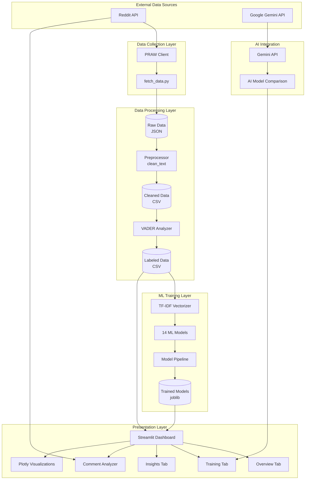
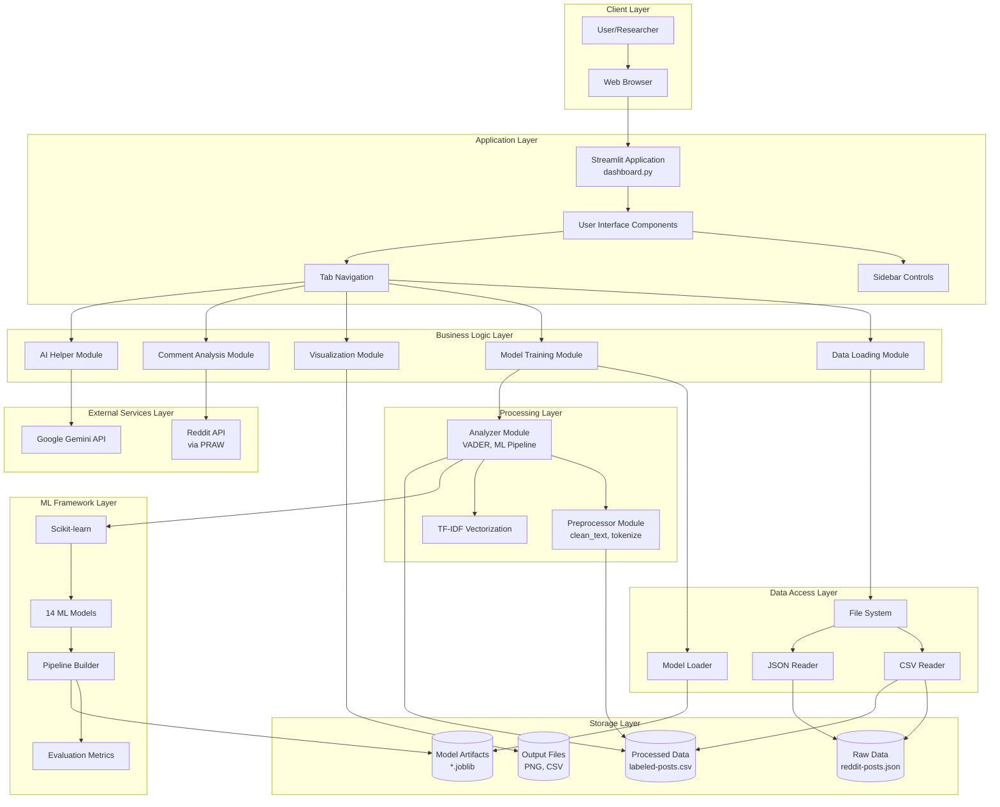
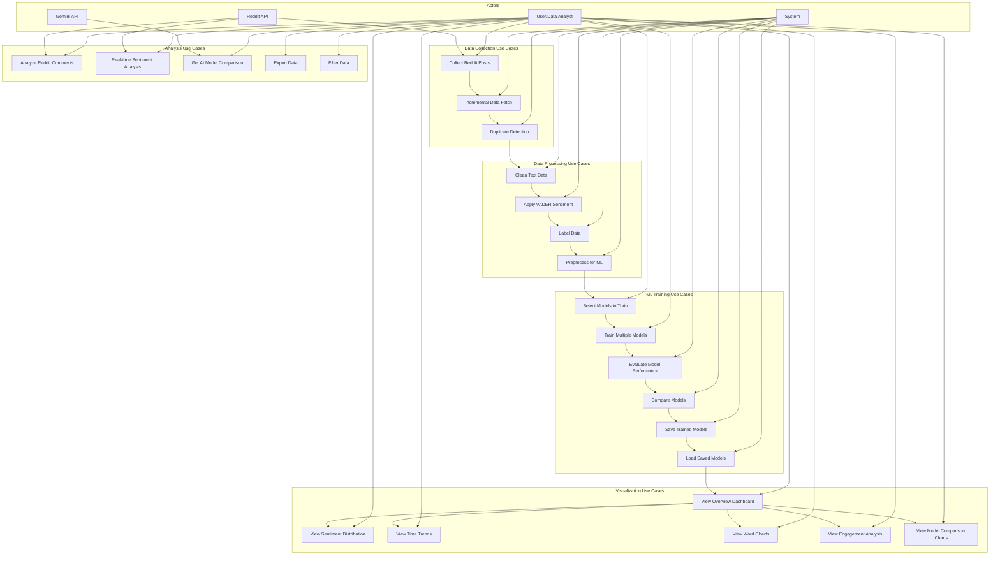
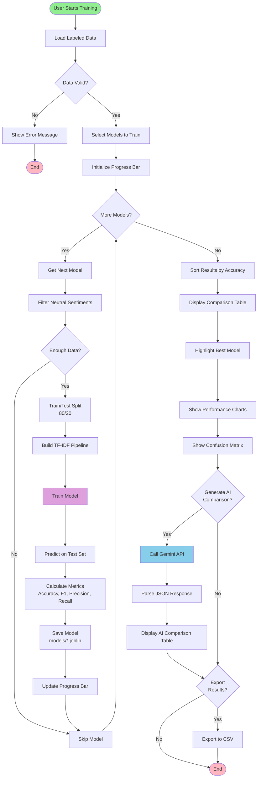
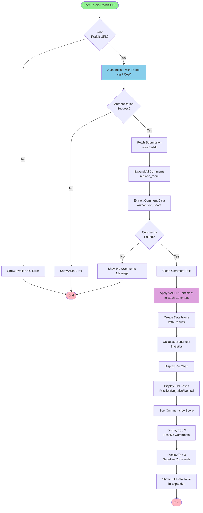
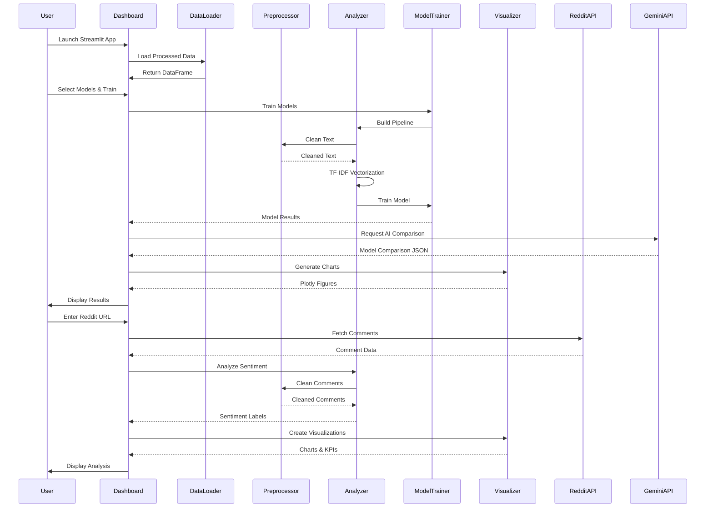

# Reddit Sentiment Analysis System - Diagrams

## 1. Proposed System Diagram

## 2. System Architecture Diagram

## 3. Dataflow Diagram

```mermaid
flowchart LR
    Start([Start]) --> Collect[Collect Reddit Posts<br/>via PRAW]
    Collect --> Check{New Posts<br/>Exist?}
    Check -->|Yes| StoreRaw[Store Raw Data<br/>reddit-posts.json]
    Check -->|No| End1([End])
    
    StoreRaw --> Load[Load Raw Data]
    Load --> Clean[Clean Text<br/>Remove URLs, punctuation, numbers]
    Clean --> Tokenize[Tokenize & Remove<br/>Stopwords]
    Tokenize --> StoreClean[Store Cleaned Data<br/>cleaned-posts.csv]
    
    StoreClean --> VADER[Apply VADER<br/>Sentiment Analysis]
    VADER --> Label[Label Sentiment<br/>Positive/Negative/Neutral]
    Label --> StoreLabel[Store Labeled Data<br/>labeled-posts.csv]
    
    StoreLabel --> Split[Train/Test Split<br/>80/20]
    Split --> Vectorize[TF-IDF<br/>Vectorization]
    Vectorize --> Train[Train ML Models<br/>14 Different Models]
    Train --> Evaluate[Evaluate Models<br/>Accuracy, F1, Precision, Recall]
    Evaluate --> Save[Save Best Model<br/>models/*.joblib]
    
    Save --> Dashboard[Load into Dashboard]
    Dashboard --> Visualize[Generate Visualizations<br/>Charts, Word Clouds]
    Visualize --> Display[Display Results<br/>Streamlit UI]
    
    Display --> Export{Export<br/>Requested?}
    Export -->|Yes| ExportData[Export Data<br/>CSV, JSON, Excel, etc.]
    Export -->|No| End2([End])
    ExportData --> End2
    
    style Start fill:#90EE90
    style End1 fill:#FFB6C1
    style End2 fill:#FFB6C1
    style Collect fill:#87CEEB
    style Train fill:#DDA0DD
    style Dashboard fill:#F0E68C
```

## 4. Use Case Diagram

## 5. Activity Diagram - Model Training Workflow

## 6. Activity Diagram - Real-time Comment Analysis

## 7. Component Interaction Diagram

---

## Diagram Descriptions

### 1. Proposed System Diagram
Shows the high-level system components and their relationships, including external APIs, data layers, ML components, and the presentation layer.

### 2. System Architecture Diagram
Details the technical architecture with layers: Client, Application, Business Logic, Data Access, Processing, ML Framework, External Services, and Storage.

### 3. Dataflow Diagram
Illustrates the complete data flow from collection through processing, training, visualization, and export.

### 4. Use Case Diagram
Defines all use cases and actors (User, System, Reddit API, Gemini API) and their interactions.

### 5. Activity Diagram - Model Training
Shows the step-by-step workflow for training multiple ML models, including error handling, progress tracking, and AI comparison integration.

### 6. Activity Diagram - Comment Analysis
Details the real-time comment analysis workflow from URL validation through sentiment analysis and visualization.

### 7. Component Interaction Diagram
Sequence diagram showing the interactions between components during typical operations.

---

*Note: These diagrams can be rendered in Markdown viewers that support Mermaid (GitHub, GitLab, many documentation tools) or converted to images using tools like Mermaid Live Editor or mermaid-cli.*

